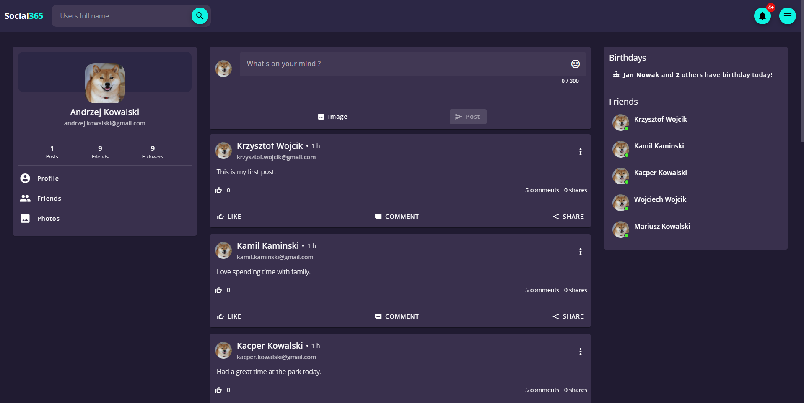
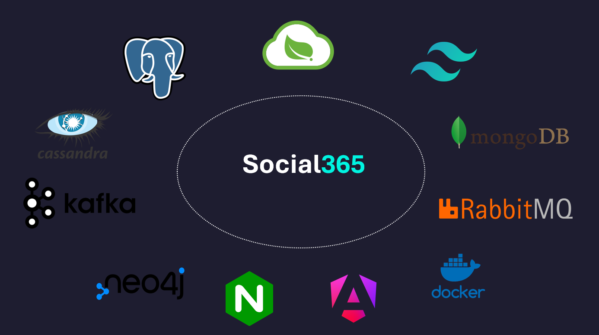
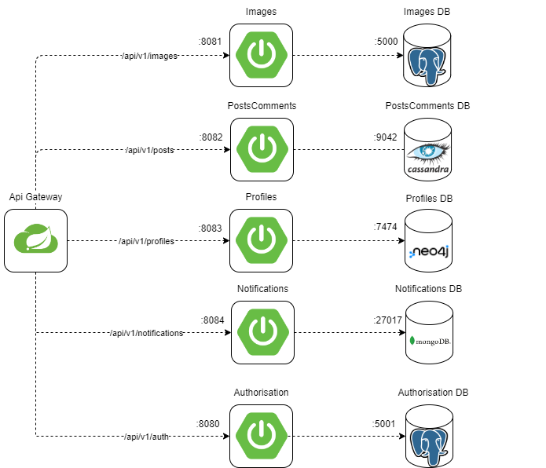

# Social365

Social Media application made with modern technologies. This is repository for my diploma project. Goal is to create an App in Microservice architecture.
Frontend is made with Angular 17 and Angular Material. Backend is made with Spring Boot 3. UI is full responsive and PWA ready.

## How this app looks like

Every view that is now part of the application is inside `screenshots` directory in subdirectories:

* `browser` - for laptop browser size,
* `browser-pwa` - for browser resized to mobile size

## Technology stack

1. Frontend

* Angular 17
* Angular Material
* Angular PWA
* Tailwindcss

2. Backend

* Spring Boot 3
* Kafka
* Lombok
* Netflix Eureka
* Spring Data
* Spring Cloud Api Gateway
* Spring Cloud Config Server
* Spring Doc OpenApi

3. Databases

* Postgres SQL
* Cassandra
* Neo4j

4. Others

* Nginx
* Docker
* Docker Compose
* DrawIo

## Diagrams

### Main architecture

    

### Microservices

    

