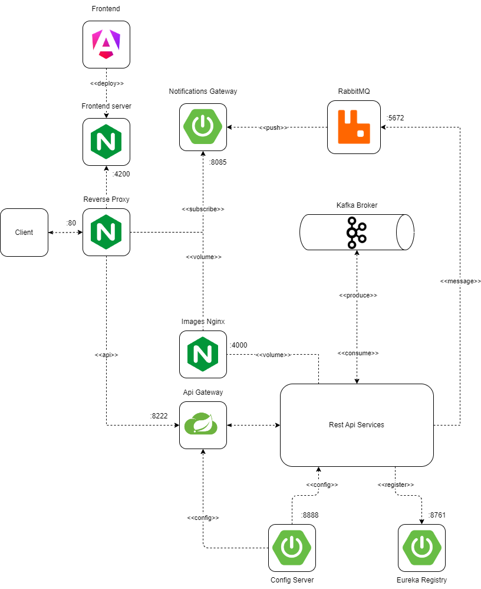

# Social365

Social Media application made with modern technologies. This is repository for my diploma project. Goal is to create an App in Microservice architecture.

## Technology stack

1. Frontend

* Angular 17
* Angular Material
* Tailwindcss

2. Backend

* Spring Boot 3
* Kafka
* Lombok
* Netflix Eureka
* Spring Data
* Spring Cloud Api Gateway
* Spring Cloud Config Server

3. Databases

* Postgres SQL
* Cassandra
* Neo4j

4. Others

* Nginx
* Docker
* Docker Compose
* DrawIo

## Diagrams

### Main architecture

    

### Microservices

    

