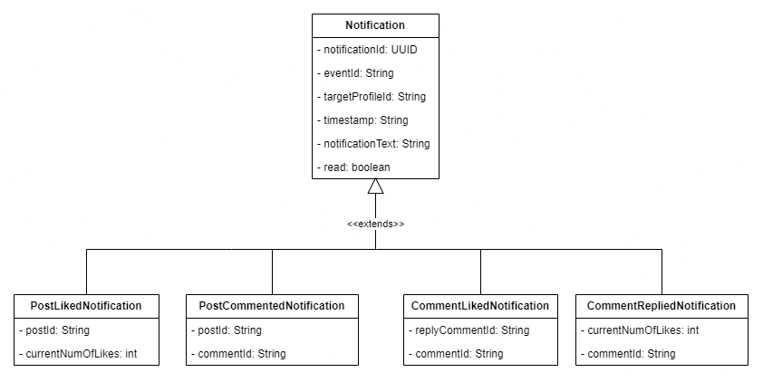

# Notifications Service

This service is responsible for sending notifications to users. It is a microservice that is part of the `Social365` app.

## Kafka Notifications Diagram

The following diagram shows what events are sent to the `notifications` topic in Kafka. The `notifications` topic is consumed by the `notifications` service.

## MongoDB Schema Diagram

The following diagram shows the schema for the `notifications` collection in MongoDB.

